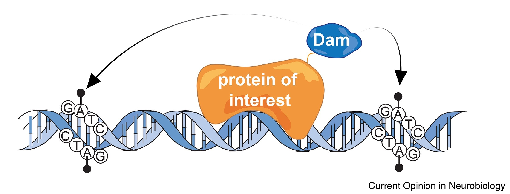

DamID principle
---------------

   
   Figure adapted from Van den Ameele et al. 2019 Current Opinion in Neurobiology

Experimental considerations
---------------------------

#. Make sure that you sequence validated your Dam expressing plasmids prior to your experiment. Cryptic expression of Dam can cause toxicity in *E. coli* and can cause selection for Dam inactivating mutations.