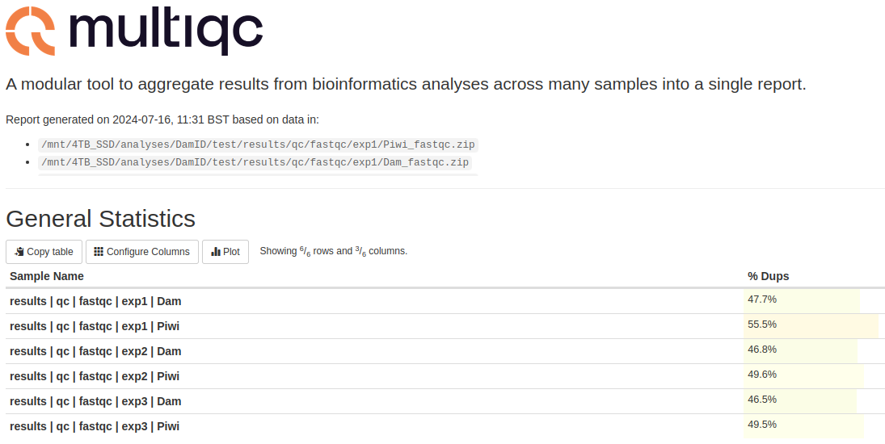
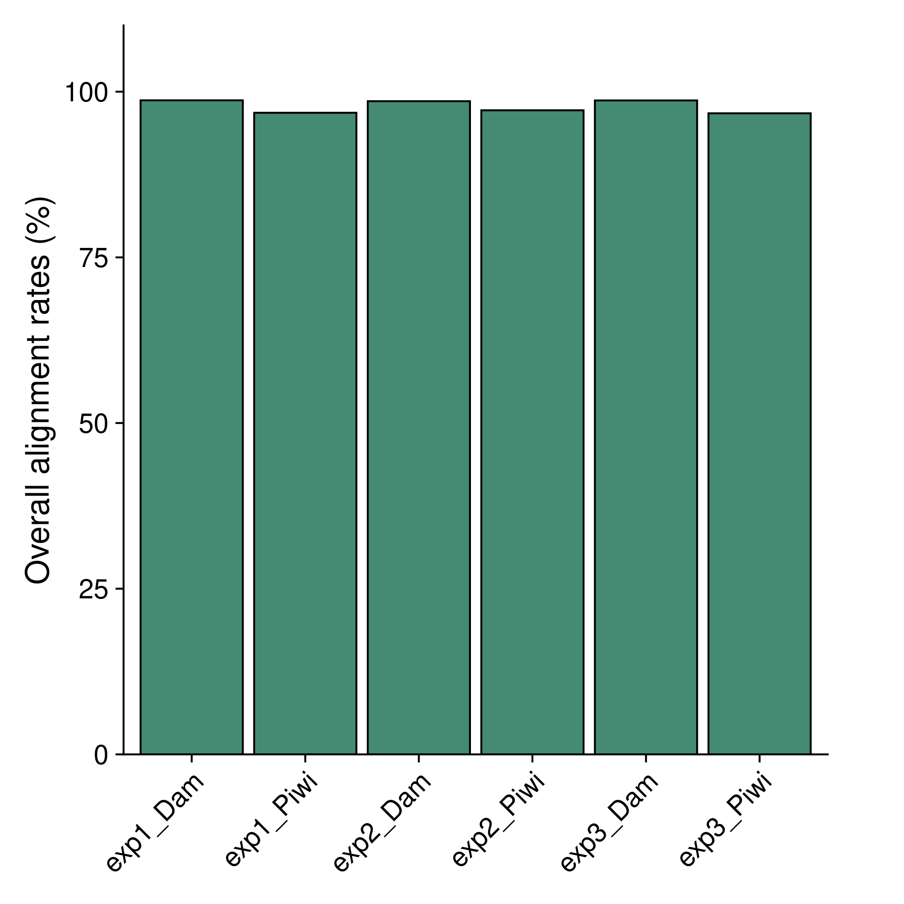
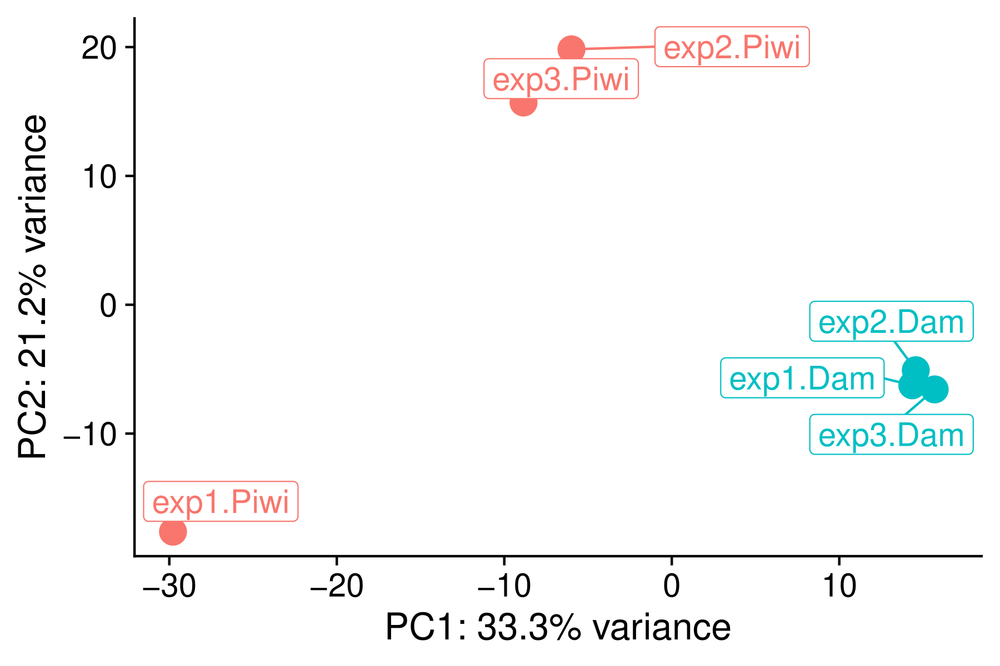
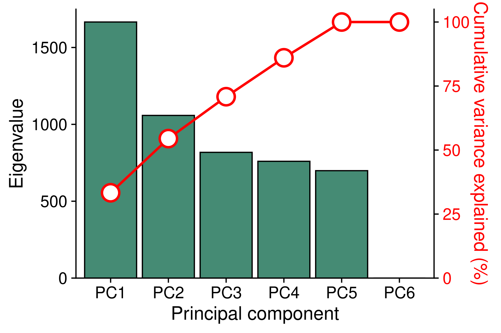
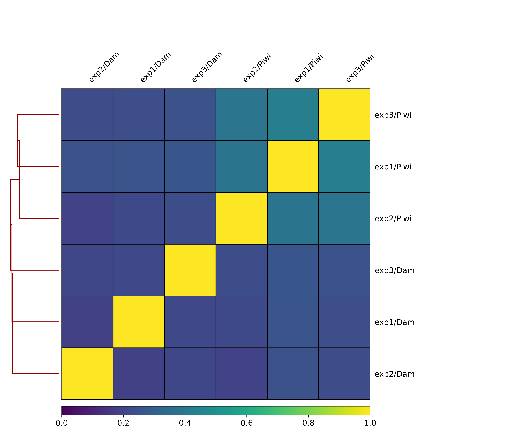
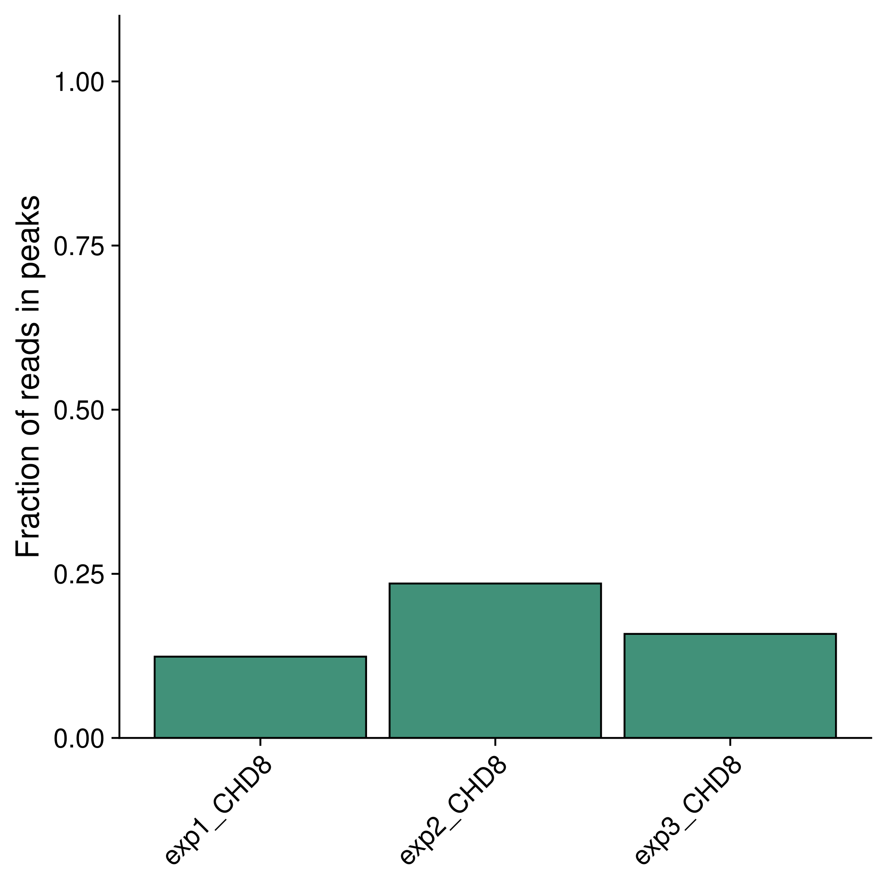
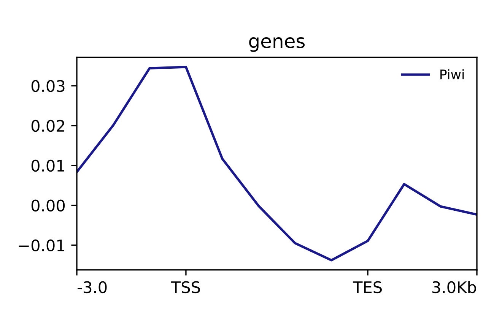
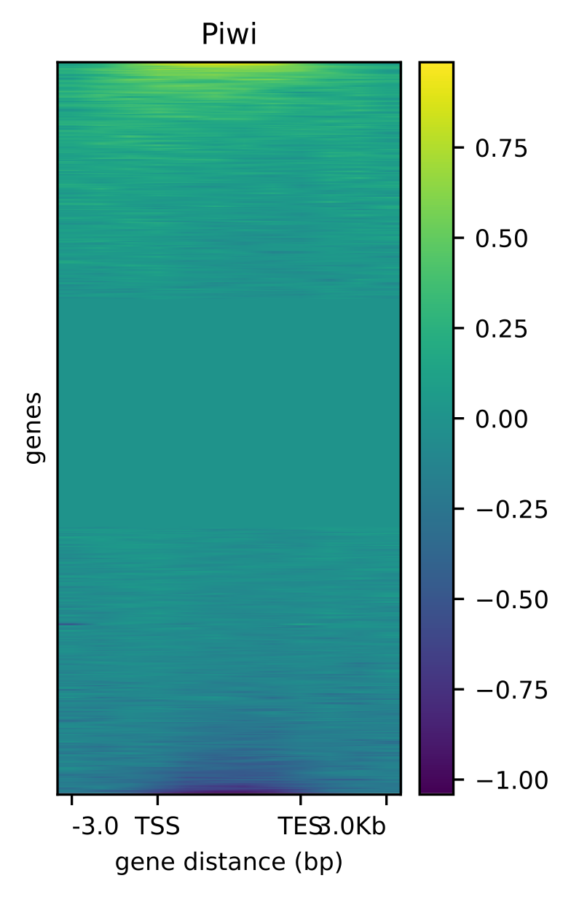
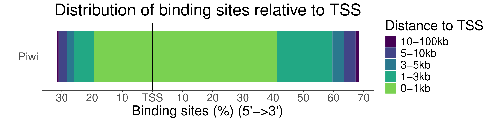
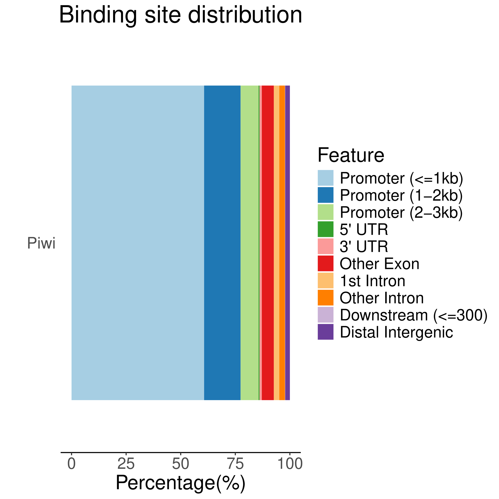

The output of `damid-seq` can be found in the `results/` directory. 

When run with the test data provided in the GitHub repository (.test/reads), the directory structure will be as follows:

.. code-block:: console

    results/
    ├── bam
    │   ├── exp1
    │   │   ├── Dam.sorted.bam
    │   │   ├── Dam.sorted.bam.bai
    │   │   ├── Piwi.sorted.bam
    │   │   └── Piwi.sorted.bam.bai
    │   ├── exp2
    │   │   ├── Dam.sorted.bam
    │   │   ├── Dam.sorted.bam.bai
    │   │   ├── Piwi.sorted.bam
    │   │   └── Piwi.sorted.bam.bai
    │   └── exp3
    │       ├── Dam.sorted.bam
    │       ├── Dam.sorted.bam.bai
    │       ├── Piwi.sorted.bam
    │       └── Piwi.sorted.bam.bai
    ├── bedgraph
    │   ├── exp1
    │   │   ├── Piwi-vs-Dam-norm.gatc.bedgraph
    │   │   ├── Piwi-vs-Dam.quantile-norm.gatc.bedgraph
    │   │   └── Piwi-vs-Dam.rev_log2.bedgraph
    │   ├── exp2
    │   │   ├── Piwi-vs-Dam-norm.gatc.bedgraph
    │   │   ├── Piwi-vs-Dam.quantile-norm.gatc.bedgraph
    │   │   └── Piwi-vs-Dam.rev_log2.bedgraph
    │   └── exp3
    │       ├── Piwi-vs-Dam-norm.gatc.bedgraph
    │       ├── Piwi-vs-Dam.quantile-norm.gatc.bedgraph
    │       └── Piwi-vs-Dam.rev_log2.bedgraph
    ├── bigwig
    │   ├── average_bw
    │   │   └── Piwi.bw
    │   ├── bam2bigwig
    │   │   ├── exp1
    │   │   │   ├── Dam.bw
    │   │   │   └── Piwi.bw
    │   │   ├── exp2
    │   │   │   ├── Dam.bw
    │   │   │   └── Piwi.bw
    │   │   └── exp3
    │   │       ├── Dam.bw
    │   │       └── Piwi.bw
    │   ├── exp1
    │   │   └── Piwi.bw
    │   ├── exp2
    │   │   └── Piwi.bw
    │   └── exp3
    │       └── Piwi.bw
    ├── bigwig_rev_log2
    │   ├── average_bw
    │   │   └── Piwi.bw
    │   ├── exp1
    │   │   └── Piwi.bw
    │   ├── exp2
    │   │   └── Piwi.bw
    │   └── exp3
    │       └── Piwi.bw
    ├── deeptools
    │   ├── average_bw_matrix.gz
    │   ├── correlation_bam.tab
    │   ├── correlation.tab
    │   ├── heatmap_matrix.gz
    │   ├── PCA_bam.tab
    │   ├── PCA.tab
    │   ├── scores_per_bin_bam.npz
    │   └── scores_per_bin.npz
    ├── peaks
    │   └── fdr0.01
    │       ├── consensus_peaks
    │       │   ├── enrichment_analysis
    │       │   │   └── Piwi.xlsx
    │       │   ├── Piwi.annotated.txt
    │       │   ├── Piwi.filtered.bed
    │       │   ├── Piwi.geneIDs.txt
    │       │   └── Piwi.overlap.bed
    │       ├── exp1
    │       │   ├── Piwi.bed
    │       │   ├── Piwi.data
    │       │   ├── Piwi.peaks.gff
    │       │   └── Piwi.sorted.bed
    │       ├── exp2
    │       │   ├── Piwi.bed
    │       │   ├── Piwi.data
    │       │   ├── Piwi.peaks.gff
    │       │   └── Piwi.sorted.bed
    │       ├── exp3
    │       │   ├── Piwi.bed
    │       │   ├── Piwi.data
    │       │   ├── Piwi.peaks.gff
    │       │   └── Piwi.sorted.bed
    │       ├── frip.csv
    │       └── read_counts
    │           ├── exp1
    │           │   ├── Piwi.peak.count
    │           │   └── Piwi.total.count
    │           ├── exp2
    │           │   ├── Piwi.peak.count
    │           │   └── Piwi.total.count
    │           └── exp3
    │               ├── Piwi.peak.count
    │               └── Piwi.total.count
    ├── plots
    │   ├── heatmap.pdf
    │   ├── mapping_rates.pdf
    │   ├── PCA_bam.pdf
    │   ├── PCA.pdf
    │   ├── peaks
    │   │   └── fdr0.01
    │   │       ├── distance_to_tss.pdf
    │   │       ├── enrichment_analysis
    │   │       │   └── Piwi
    │   │       │       ├── GO_Biological_Process_2018.pdf
    │   │       │       ├── GO_Molecular_Function_2018.pdf
    │   │       │       └── KEGG_2019.pdf
    │   │       ├── feature_distributions.pdf
    │   │       └── frip.pdf
    │   ├── profile_plot.pdf
    │   ├── sample_correlation_bam.pdf
    │   ├── sample_correlation.pdf
    │   ├── scree_bam.pdf
    │   └── scree.pdf
    ├── qc
    │   ├── fastqc
    │   │   ├── exp1
    │   │   │   ├── Dam_fastqc.zip
    │   │   │   ├── Dam.html
    │   │   │   ├── Piwi_fastqc.zip
    │   │   │   └── Piwi.html
    │   │   ├── exp2
    │   │   │   ├── Dam_fastqc.zip
    │   │   │   ├── Dam.html
    │   │   │   ├── Piwi_fastqc.zip
    │   │   │   └── Piwi.html
    │   │   └── exp3
    │   │       ├── Dam_fastqc.zip
    │   │       ├── Dam.html
    │   │       ├── Piwi_fastqc.zip
    │   │       └── Piwi.html
    │   └── multiqc
    │       ├── multiqc_data
    │       │   ├── multiqc_citations.txt
    │       │   ├── multiqc_data.json
    │       │   ├── multiqc_fastqc.txt
    │       │   ├── multiqc_general_stats.txt
    │       │   ├── multiqc.log
    │       │   ├── multiqc_software_versions.txt
    │       │   └── multiqc_sources.txt
    │       └── multiqc.html
    └── trimmed
        ├── exp1
        │   ├── Dam.fastq.gz_trimming_report.txt
        │   ├── Dam.flag
        │   ├── Piwi.fastq.gz_trimming_report.txt
        │   └── Piwi.flag
        ├── exp2
        │   ├── Dam.fastq.gz_trimming_report.txt
        │   ├── Dam.flag
        │   ├── Piwi.fastq.gz_trimming_report.txt
        │   └── Piwi.flag
        └── exp3
            ├── Dam.fastq.gz_trimming_report.txt
            ├── Dam.flag
            ├── Piwi.fastq.gz_trimming_report.txt
            └── Piwi.flag

50 directories, 118 files

Quality control
---------------

FastQC/MultiQC
==============

FastQC is used to do some control check on the trimmed reads. 

The output of FastQC is summarized in a MultiQC report (results/qc/multiqc/multiqc.html).

Alignment rates
===============

The Bowtie2 alignment rates are summarised in results/plots/mapping_rates.pdf.

PCA plot of BAM files
=====================

A PCA plot of the BAM files is generated to check the consistency of biological replicates. The plot is saved in results/plots/PCA_bam.pdf. 

A scree plot is also generated to show the variance explained by each principal component (results/plots/scree_bam.pdf).

Sample correlation heatmap
==========================

A correlation (Spearman) heatmap of the BAM files is generated to also check the consistency of biological replicates. The plot is saved in results/plots/sample_correlation_bam.pdf.

Fraction of reads in peaks (FRiP)
=================================

The FRiP is calculated for each sample and plotted in results/plots/peaks/frip.pdf, when using the Perl peak calling script, or results/plots/macs2\_[broad or narrow]/fdr[value]/frip.pdf.

Visualization of damid-seq data
-------------------------------

Profile plot
============

Using deepTools, a profile plot is generated to show the average coverage of the reads around defined features of the genome (TSS or gene body). The plot is saved in results/plots/profile_plot.pdf.

Heatmap

A heatmap of the coverage of the reads around defined features of the genome (TSS or gene body) is also generated. The plot is saved in results/plots/heatmap.pdf.

Peak-related plots
------------------

Various plot are created relating to peak data.

Distance to TSS
===============

A plot showing the distance of the peaks to the nearest transcription start site (TSS) is generated. The plot is saved in results/plots/[peaks, macs2_broad, macs2_narrow]/fdr[value]/distance_to_tss.pdf.

Binding site distributions
==========================

A plot showing the distribution of the peaks across different genomic features is generated. The plot is saved in results/plots/[peaks, macs2_broad, macs2_narrow]/fdr[value]/feature_distributions.pdf.

