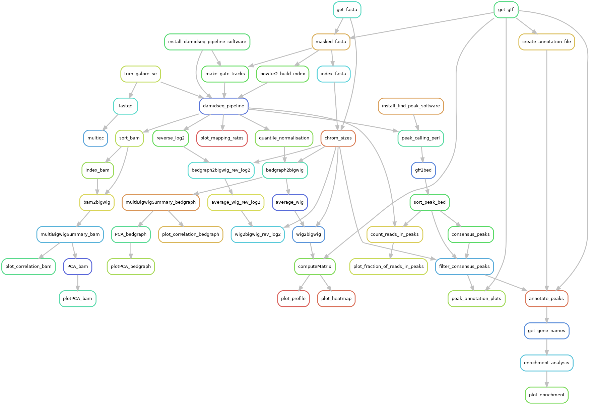

Preparing raw sequencing data
-----------------------------

Matching number of Dam-only and Dam-protein samples
===================================================

In the directory containing config/workflow create a directory called reads:

.. code-block:: console
    
    $ cd /path/to/analysis
    $ mdkir -p reads

Data files from each group of biological replicates should be placed into a unique folder, e.g.:

.. code-block:: console
    
    reads/
    ├── exp1
    │   ├── Dam.fastq.gz
    │   └── Piwi.fastq.gz
    ├── exp2
    │   ├── Dam.fastq.gz
    │   └── Piwi.fastq.gz
    └── exp3
        ├── Dam.fastq.gz
        └── Piwi.fastq.gz

.. note::
    
    Single-end fastq files should always end with `fastq.gz`, while paired-end reads should end with *\_R1\_001.fastq.gz/\_R2\_001.fastq.gz*.

    Also, the Dam only control should always be called Dam.fastq.gz or Dam_R1_001.fastq.gz and Dam_R2_001.fastq.gz for single-end and paired-end reads, respectively.

Non-matching number of Dam-only and Dam-protein samples
=======================================================

In some cases the number of non-Dam and Dam samples might not match. In this case, place all the read files together in the reads directory as follows:

.. code-block:: console
    
    reads/
    ├── Dam_1.fastq.gz
    ├── Dam_2.fastq.gz
    ├── Piwi_1.fastq.gz
    ├── Piwi_2.fastq.gz
    └── Piwi_3.fastq.gz

When `damid-seq` is run is this case, it will create directories in reads/ for each Dam-only sample matching all non-Dam samples. Symlinks will be created in these directories to the original files in reads/:

.. code-block:: console

    reads/
    ├── Dam_1.fastq.gz
    ├── Dam_2.fastq.gz
    ├── Piwi_1.fastq.gz
    ├── Piwi_2.fastq.gz
    ├── Piwi_3.fastq.gz
    ├── repl_1
    │   ├── Dam.fastq.gz -> /mnt/4TB_SSD/analyses/DamID/test/reads/Dam_1.fastq.gz
    │   └── Piwi.fastq.gz -> /mnt/4TB_SSD/analyses/DamID/test/reads/Piwi_1.fastq.gz
    ├── repl_2
    │   ├── Dam.fastq.gz -> /mnt/4TB_SSD/analyses/DamID/test/reads/Dam_2.fastq.gz
    │   └── Piwi.fastq.gz -> /mnt/4TB_SSD/analyses/DamID/test/reads/Piwi_1.fastq.gz
    ├── repl_3
    │   ├── Dam.fastq.gz -> /mnt/4TB_SSD/analyses/DamID/test/reads/Dam_1.fastq.gz
    │   └── Piwi.fastq.gz -> /mnt/4TB_SSD/analyses/DamID/test/reads/Piwi_2.fastq.gz
    ├── repl_4
    │   ├── Dam.fastq.gz -> /mnt/4TB_SSD/analyses/DamID/test/reads/Dam_2.fastq.gz
    │   └── Piwi.fastq.gz -> /mnt/4TB_SSD/analyses/DamID/test/reads/Piwi_2.fastq.gz
    ├── repl_5
    │   ├── Dam.fastq.gz -> /mnt/4TB_SSD/analyses/DamID/test/reads/Dam_1.fastq.gz
    │   └── Piwi.fastq.gz -> /mnt/4TB_SSD/analyses/DamID/test/reads/Piwi_3.fastq.gz
    ├── repl_6
    │   ├── Dam.fastq.gz -> /mnt/4TB_SSD/analyses/DamID/test/reads/Dam_2.fastq.gz
    │   └── Piwi.fastq.gz -> /mnt/4TB_SSD/analyses/DamID/test/reads/Piwi_3.fastq.gz
    └── sample_matrix.csv

`sample_matrix.csv`` file contains a log of which file was symlinked to which directory:

.. code-block:: console

    dir
    "['reads/repl_1', 'reads/Dam_1.fastq.gz', 'reads/Piwi_1.fastq.gz']"
    "['reads/repl_2', 'reads/Dam_2.fastq.gz', 'reads/Piwi_1.fastq.gz']"
    "['reads/repl_3', 'reads/Dam_1.fastq.gz', 'reads/Piwi_2.fastq.gz']"
    "['reads/repl_4', 'reads/Dam_2.fastq.gz', 'reads/Piwi_2.fastq.gz']"
    "['reads/repl_5', 'reads/Dam_1.fastq.gz', 'reads/Piwi_3.fastq.gz']"
    "['reads/repl_6', 'reads/Dam_2.fastq.gz', 'reads/Piwi_3.fastq.gz']"

Sample meta data and analysis settings
--------------------------------------

The config/ directory contains `samples.csv` with sample meta data as follows:

+-----------+----------+-----------+
| sample    | genotype | treatment |
+===========+==========+===========+
|Piwi       | WT       | None      |
+-----------+----------+-----------+
|Dam        | WT       | None      |
+-----------+----------+-----------+

`config.yaml` in the same directory contains the settings for the analysis:

.. code-block:: yaml
    
    genome: dm6
    ensembl_genome_build: 110
    plasmid_fasta: none # Path to plasmid fasta file with sequences to be removed
    fusion_genes: 
        genes: FBgn0004872 # Ensembl gene IDs for genes to be masked from the fasta file
        feature_to_mask: "exon" # Gene feature to mask from the fasta file (exon or gene)
    damidseq_pipeline:
        normalization: kde # kde, rpm or rawbins
        binsize: 300
        extra: "" # extra argument for damidseq_pipeline
    quantile_normalisation:
        apply: True
        extra: "" # extra argument for quantile_normalization
    deeptools:
        bamCoverage: # bam to bigwig conversion for QC
            binSize: 10
            normalizeUsing: RPKM
            extra: ""
    matrix: # Settings for computeMatrix
        mode: scale-regions # scale-regions or reference-point
        referencePoint: TSS # TSS, TES, center (only for reference-point mode)
        regionBodyLength: 6000
        upstream: 3000
        downstream: 3000
        binSize: 100
        averageTypeBins: mean
        regionsFileName: "" # BED or GTF file(s) with regions of interest (optional, whole genome if not specified)
        no_whole_genome: False # If True, will omit whole genome as region and only use regionsFileName(s)
        extra: "" # Any additional parameters for computeMatrix
    plotHeatmap:
        interpolationMethod: auto
        plotType: lines # lines, fill, se, std
        colorMap: viridis # https://matplotlib.org/2.0.2/users/colormaps.html
        alpha: 1.0
        extra: "" 
    peak_calling_perl:
        run: True
        iterations: 5 # N argument
        fdr: 0.01
        fraction: 0 # Fraction of random fragments to consider per iteration
        min_count: 2 # Minimum number of reads to consider a peak
        min_quantile: 0.95 # Minimum quantile for considering peaks
        step: 0.01 # Stepping for quantiles
        unified_peaks: max # Method for calling peak overlaps. 'min': call minimum overlapping peak area. 'max': call maximum overlap as peak
        extra: "" 
    peak_calling_macs2:
        run: False
        mode: narrow
        qvalue: 0.05 # for narrow peaks
        broad_cutoff: 0.1 # for broad peaks
        extra: ""
    consensus_peaks:
        max_size: 10 # Maximum size of peaks to be extended
        extend_by: 40 # Number of bp to extend peaks on either side
        keep: 2 # Minimum number peaks that must overlap to keep
        enrichment_analysis: 
        run: True # Perform enrichment analysis
        dbs: ["GO_Molecular_Function_2018","GO_Biological_Process_2018","KEGG_2019"]
        terms: 10 # Number of terms to plot
    resources: # computing resources
        trim:
            cpu: 8
            time: 60
        fastqc:
            cpu: 4
            time: 60
        damid:
            cpu: 24
            time: 720
            tmpdir: /tmp
        index:
            cpu: 40
            time: 60
        deeptools:
            cpu: 8
            time: 90
        plotting:
            cpu: 2
            time: 20

A lot of the DamID signal can come from the plasmids that are used to express the Dam-POIs, and this can skew the analysis.

To prevent this, two approaches are available:

1.  The genes (Ensembl gene IDs) fused to Dam can be set in config.yaml["fusion_genes] (separated by commas if multiple plasmids are used). This will mask the features set in config > fusion_genes > feature_to_mask (exons or gene) of these genes in the fasta file that will be used to build the Bowtie2 index, hence excluding these regions from the analysis. 

.. note::
    
    To disable this function set the value of config.yaml["fusion_genes"] to "".

2. If a plasmid is used that for example also uses an endogenous promoter besides the Dam fusion proteins, one can set a path to a fasta file containg all the plasmid sequences in config.yaml[""]. Trimmed reads are first aligned to these sequences, and the resulting non-aligning reads will then be processed as normal.

It is recommended to store this file in a directory called resources within the analysis folder (this folder will also contain all other non-experimental files such as fasta and gtf files).

.. note::
    
    To disable this function set the value of config.yaml["plasmid_fasta"] to none.

Configuration of Snakemake
--------------------------

Running Snakemake can entail quite a few command line flags. To make this easier these can be set in a global profile that is defined in a user-specific configuration directory in order to simplify this process.

.. code-block:: yaml
    
    cores: 40
    latency-wait: 20
    use-conda: True
    use-apptainer: True
    keep-going: False
    rerun-incomplete: True
    printshellcmds: True
    show-failed-logs: True

When running on a slurm-based HPC, the following lines should be included in `config.yaml`:

.. code-block:: yaml
    
    executor: slurm
    jobs: 100
    apptainer-args: "--bind '/parent_dir/of/analysis'" # if analysis in not in /home/$USER
    local-cores: 4 # Limit core usage for local rules
    default-resources:
            slurm_partition: icelake
            slurm_account: <ACCOUNT>

Some system have limited space allocated to /tmp, which can be problematic when using Apptainer. Add the following line to ~/.bashrc to set a different temporary directory location:

.. code-block:: console
    
    export APPTAINER_TMPDIR=~/path/to/tmpdir

Dry-run of the analysis
-----------------------

Before running the actual analyis with your own data, a dry-run can be performed:

.. code-block:: console
    
    $ snakemake -np

Visualization of the workflow
-----------------------------

To visualize the workflow run (this command excludes the target rule from the rule graph):

.. code-block:: console
    
    $ mkdir -p images
    $ snakemake --forceall --rulegraph | grep -v '\-> 0\|0\[label = \"all\"' | dot -Tpng > images/rule_graph.png

    Rule graph of the Snakemake workflow.

Running the analysis
--------------------

After a successful dry-run, the actual analysis can be initiated as follows:

.. code-block:: console
    
    $ snakemake --profile /home/user/.config/snakemake/profile

.. note::
    
    Do not use `~` in the path to the config file directory. Use the full path instead.

Report of the results
---------------------

When the analysis has finished succesfully, an HTML report can be created as follows:

.. code-block:: console
    
    $ snakemake --report report.html

This report will contain run time information for the Snakemake rules, as well as figures generated by the workflow, and the code used to create these.

Archive of the analysis
-----------------------

To archive the whole analysis, the following command can be used:

.. code-block:: console
    
    $ snakemake --archive /path/to/archive.tar.gz

This process will archive all code and configuration files under Git version control, include all input files in the archive, and incorporate the software packages from each specified Conda environment. The result is a self-contained workflow archive that can be re-executed on a clean machine with only Conda and Snakemake installed.

.. note::

    Please note that the archive is platform-specific. For instance, if it is created on a Linux system, it will run on any Linux version newer than the minimum version supported by the Conda packages at the time of archiving.